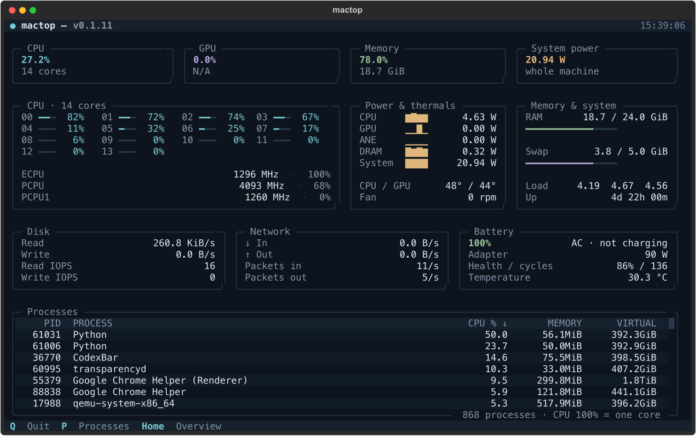

# mactop

Mactop is a terminal dashboard for macOS. It displays CPU and GPU activity,
power, temperatures, memory, disk and network traffic, battery health, and
processes using metrics collected directly from macOS.



## Quick start

Install [uv](https://docs.astral.sh/uv/getting-started/installation/), then run:

```shell
git clone https://github.com/laixintao/mactop.git
cd mactop
uv sync --locked
uv run mactop
```

The project selects Python 3.10 through `.python-version`. uv manages the
interpreter and local `.venv`; you do not need to activate the environment.

Live collection requires macOS. Power and performance-state metrics primarily
target Apple Silicon; availability on Intel Macs depends on the native counters
and sensors exposed by the machine. Unsupported readings appear as `N/A`.
Collection runs as your current user through Python's `ctypes` and psutil,
without `sudo`, external metrics commands, or a Go build.

## Dashboard

The default layout includes:

- CPU, GPU, RAM, and whole-machine power summaries.
- Per-core CPU usage, CPU cluster frequency and activity, short power histories,
  temperatures, and fan speed.
- Memory, swap, load averages, uptime, disk and network rates, and battery status.
- A process table sorted by CPU usage, with resident and virtual memory columns.

Wide windows show separate cards for memory, disk, network, and battery.
Smaller windows combine secondary readings or stack cards vertically. The
page scrolls when the content does not fit; the process table scrolls separately.

| Key | Action |
| --- | --- |
| `p` | Focus and reveal the process table |
| `Home` | Return to the overview |
| `Up` / `Down` | Scroll the overview, or move through a focused process table |
| `j` / `k` | Scroll the overview down / up |
| `Page Up` / `Page Down` | Move by a page in the active view |
| `q` / `Ctrl+C` | Quit and stop sampling |

The mouse wheel also scrolls the dashboard and process table.

Power mini-charts scale each component's recent samples independently. Compare
components using the watt values beside the charts. RAM usage is calculated as
`total - available`, consistently across the summary and memory card. Process
CPU uses 100% per fully occupied core and can exceed 100%.

## Command-line usage

Set the sampling interval, in seconds:

```shell
uv run mactop --refresh-interval 2
```

The interval defaults to one second and must be a positive, finite number.
The first published sample follows a warm-up interval so cumulative counters
can be converted to rates.

The default theme is `m1.xml` on Apple Silicon and `mactop.xml` on Intel. Both
use the compact dashboard. Select a built-in theme or a custom XML file with
`--theme`:

```shell
uv run mactop --theme m1.xml
uv run mactop --theme ./my-theme.xml
```

To emit newline-delimited JSON instead of opening the dashboard:

```shell
uv run mactop --json --count 5 --refresh-interval 1
uv run mactop --json > metrics.jsonl
```

`--count` requires `--json` and a positive integer. Omit it to stream until
interrupted. Each line contains one snapshot with `timestamp`, `hardware`,
`system`, `battery`, and `errors` fields. JSON uses watts, hertz, bytes, and
bytes per second for the corresponding measurements; missing values are `null`.

See the [metrics reference](docs/metrics.md) for field names, units, calculations,
and sampling behavior. Run `uv run mactop --help` for all options or
`uv run mactop --version` to check the version.

## Custom themes

Themes are XML layouts with Textual CSS in a `<style>` element. Start with a
copy of a built-in theme to retain the default colors and spacing:

```shell
cp mactop/themes/m1.xml my-theme.xml
uv run mactop --theme ./my-theme.xml --auto-reload
```

The application reloads when you save the theme. This is a local development
feature; it does not deploy or publish anything.

A minimal layout looks like this:

```xml
<Mactop>
  <layout>
    <OverviewPanel />
    <TaskTable id="processes" />
  </layout>
  <style>
    Dashboard {
      padding: 1;
    }
    #processes {
      height: 12;
      margin-top: 1;
    }
  </style>
</Mactop>
```

Use `Vertical` and `Horizontal` containers to group panels. Widgets support
`id`, `name`, and space-separated `class` or `classes` attributes. Metric panels
also accept `refresh_interval`, which overrides their display refresh interval;
the CLI interval still controls sampling.

`OverviewPanel` provides the responsive summary cards, and `TaskTable` provides
the process list. Individual panels remain available for custom layouts; for
example, `<PowerPanel component="ane" label="ANE Power" />` shows ANE power.
The [panel registry](mactop/panels/__init__.py) lists all supported components,
and their constructors define additional attributes. The overview's internal
card palette and arrangement are defined in
[overview.py](mactop/panels/overview.py); theme CSS styles its surrounding widget.

## Missing readings and diagnostics

Missing, unsupported, or failed readings are `N/A` in the dashboard and `null`
in JSON. A measured zero remains zero. A frequency can be unavailable while
utilization is valid, such as when there is no active residency in the sample
or no matching frequency table.

Source-level errors appear in the dashboard header and JSON `errors` object.
One unavailable source does not prevent the other sources from updating.
Enable logging to inspect the details:

```shell
uv run mactop -vvv --log-to mactop.log
```

Use `tail -f mactop.log` in another terminal to follow the log. Logging is
opt-in, and `-vvv` enables debug verbosity.

To also save each published native snapshot under `./debug_json`:

```shell
uv run mactop -vvv --log-to mactop.log --debug
```

Snapshot files are named `mactop_<timestamp_ns>.json`. They contain the same
metric structure as JSON output and can help identify unavailable channels or
sensors.

## Development

Dependencies and build configuration live in `pyproject.toml`; `uv.lock` records
the resolved versions. Install the runtime and development dependencies, run
the tests, and build the package with:

```shell
uv sync --locked
uv run --locked pytest
uv build
```

Builds produce a wheel and source distribution under `dist/`. The Makefile
provides equivalent local `run`, `test`, and `build` targets. Automated
publishing, version tagging, and the previous powermetrics/iSMC workflow have
been removed.

The test suite covers native counter calculations, missing data, collector
lifecycle, CLI behavior, and dashboard interaction at multiple terminal sizes.
The metrics reference includes a [source map](docs/metrics.md#source-map) for
contributors.

## License

See [LICENSE](LICENSE) for the project license and
[THIRD_PARTY_NOTICES.md](THIRD_PARTY_NOTICES.md) for native API reference
attribution.
