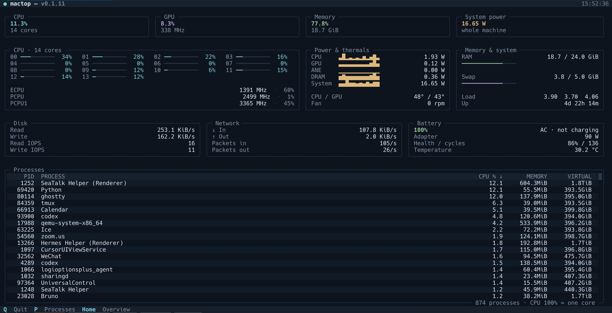

# mactop

A terminal system monitor for macOS, with a compact dashboard and direct access
to native metrics.



## Installation

You need macOS, Git, and [uv](https://docs.astral.sh/uv/getting-started/installation/).
The current dashboard has been tested on Apple Silicon. Available power,
frequency, temperature, and battery readings depend on the machine.

### Run from source

```shell
git clone https://github.com/laixintao/mactop.git
cd mactop
uv sync --locked
uv run --locked mactop
```

Run these commands from the project directory. uv uses the Python 3.10 version
specified in `.python-version`, downloads it if needed, and creates `.venv`.
You do not need to activate the environment or run mactop with `sudo`.

For an existing checkout, update it with:

```shell
git pull --ff-only
uv sync --locked
uv run --locked mactop
```

### Install the `mactop` command

To run mactop from any directory, install the local checkout as a uv tool:

```shell
# Run inside the cloned mactop directory.
uv tool install --python 3.10 .
mactop
```

If your shell cannot find the command, run `uv tool update-shell` and open a new
terminal. Tool installation uses a separate environment and resolves dependencies
from `pyproject.toml`; running from source uses the versions in `uv.lock`.

After updating the checkout, reinstall with `uv tool install --python 3.10 --force .`.
To remove the installed command, run `uv tool uninstall mactop`.

The examples below use `uv run --locked mactop` from the checkout. If you installed
the tool, use `mactop` with the same arguments.

## What it shows

- Total and per-core CPU usage, plus available Apple Silicon cluster frequencies.
- GPU usage and frequency, and CPU, GPU, ANE, DRAM, and whole-machine power.
- CPU/GPU temperatures and fan speed, where sensors are available.
- RAM, swap, load averages, uptime, and disk/network rates.
- Battery charge, charging state, health, cycle count, temperature, and adapter watts.
- Processes sorted by CPU usage, with resident and virtual memory.

The layout adapts to the terminal width. Smaller windows combine or stack cards,
and the page scrolls when needed. Missing readings show `N/A`; a measured zero
is displayed as zero. Power charts scale each component independently, so use
the watt values to compare components. Process CPU can exceed 100% when a process
uses multiple cores.

## Usage

The refresh interval defaults to one second. Change it with `-r`:

```shell
uv run --locked mactop -r 2
```

| Key | Action |
| --- | --- |
| `p` | Focus the process table |
| `Home` | Return to the overview |
| `Up` / `Down` | Scroll the page or move through the focused process table |
| `j` / `k` | Scroll the page down / up |
| `Page Up` / `Page Down` | Move by a page in the active view |
| `q` / `Ctrl+C` | Quit |

The mouse wheel also scrolls the page and process table.

### JSON output

```shell
uv run --locked mactop --json --count 5
uv run --locked mactop --json > metrics.jsonl
```

Each line is a JSON snapshot. Omit `--count` to stream until interrupted.
`--count` requires `--json`; the first sample follows a warm-up interval.
Missing readings are `null`. See the [metrics reference](docs/metrics.md) for
sources, calculations, fields, and units.

### Layout files

`--theme` selects an XML layout. Both bundled files, `m1.xml` and `mactop.xml`,
currently use the same dashboard layout. For editing layouts and reloading them
while the app runs, see [Custom layouts](docs/layouts.md).

### Diagnostics

```shell
uv run --locked mactop -vvv --log-to mactop.log
uv run --locked mactop --json --count 2 --debug
```

Logging is enabled by `--log-to`; `-vvv` selects debug verbosity. `--debug` saves
snapshots under `./debug_json`. Source errors appear in the UI header and the
JSON `errors` object. Use `uv run --locked mactop --help` for all CLI options.

## Development

```shell
uv sync --locked
uv run --locked pytest
uv build
```

Build artifacts are written to `dist/`. The Makefile provides `run`, `test`, and
`build` targets. See the [source map](docs/metrics.md#source-map) for the collector
and UI modules.

## License

See [LICENSE](LICENSE) and [THIRD_PARTY_NOTICES.md](THIRD_PARTY_NOTICES.md).
