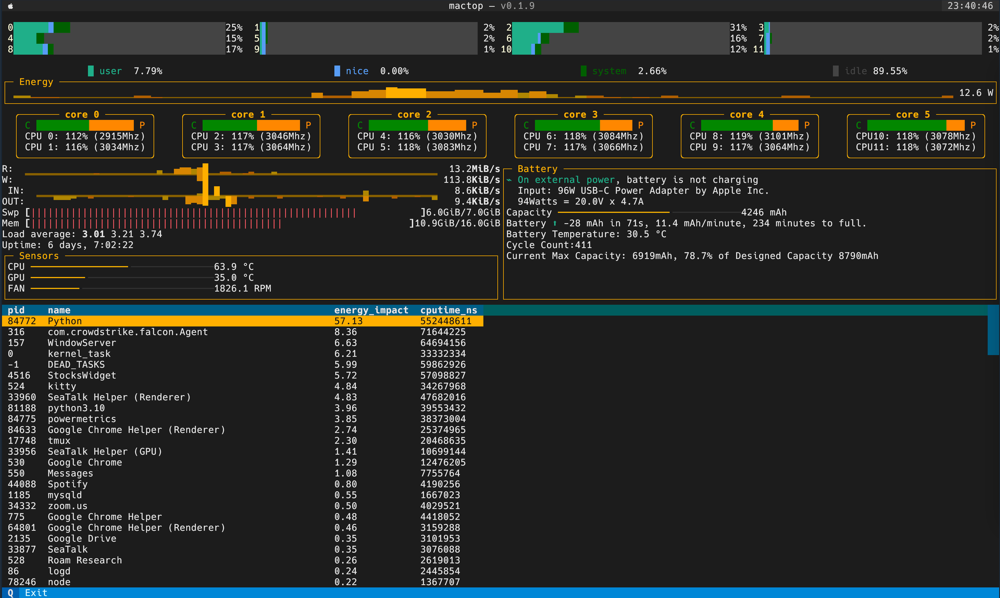

# mactop

Mactop is a tool like htop, but you can decide the data you want and decide the
layout. It is more like a Grafana for your macbook, but in terminal.

It looks like this:



## Installation

```shell
pip install mactop
```

## Usage

```
sudo mactop
```

It requires `sudo` because `powermetrics` requires `sudo`, you can run `mactop`
without `sudo` but some metrics will be missing.

For M1 Macbook users, please run:

```
sudo mactop -t m1.xml
```

What is `-t` here? It's for "theme"! And you can have your own theme!

## Design Your Own Mactop

We use HTML + CSS style to setup the layout.

You can use `id` or `class` to select the element, like this:

```html
<Mactop>
  <layout>
    <Horizontal id="row-1">
      <SensorsPanel></SensorsPanel>
    </Horizontal>
  </layout>

  <style>
    #row-1 {
      color: red;
    }
  </style>
</Mactop>
```

Save your content to a file, for example, `my-theme.xml`, then run `mactop` with
`mactop -t my-theme.xml`.

Components do not support inline-css, but you can set attributes on components.

Common attributes that every components support:

- `id`;
- `class` or `classes`, separated by space;
- `refresh_interval`: set this will overwrite command line arguments
  `--refresh-interval` for that component.

For component's supported attributes and component's name, please refer to
`mactop/panels/__init__.py` and check the source code. Please bare with me, it
is messy for now, I am working on documentations. If you have any questions,
feel free to open an issue.

For examples of layouts, you can refer `mactop/themes/` directory.

If you made some beautiful layout, please send it to me! By open a PR or issue,
I can merge it into this repo, thanks.

## Debug

Mactop comes with verbose log support.

`-v` means enable `info` log, and more `v` means more logs, max `-vvv`.

```shell
mactop -vvv -l mactop.log
```

Then you can open another terminal `tail -f mactop.log` to see the logs.

Mactop use `powermetrics` to get metrics from your mactop, `powermetrics` is
different on different Macbooks. If you met some issue, better submit a
`powermetrics` sample in the issue, thanks.

Use this command (add `--debug`), Mactop will write json formatted powermetrics
file on your current `$(PWD)/debug_json`. (If you decide to paste it, only one
sample (one file) is enough).

```shell
$ mactop -vvv -l mactop.log --debug
$ ls debug_json
mactop_debug_20231206_16:34:28.json  mactop_debug_20231206_16:41:55.json  mactop_debug_20231206_16:46:21.json
mactop_debug_20231206_16:34:29.json  mactop_debug_20231206_16:44:46.json
```

## Development

This project use [poetry]() to manage dependencies.

Clone this project and make sure you have poetry.

```shell
pip install poetry
git clone git@github.com:laixintao/mactop.git
```

Then install dependencies:

```shell
poetry install
```

You can then make changes, and test with `poetry run mactop`.
